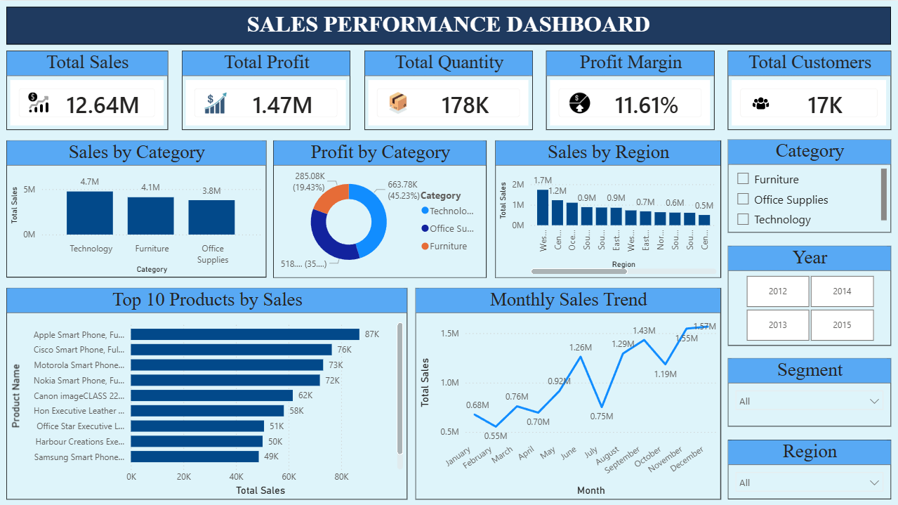
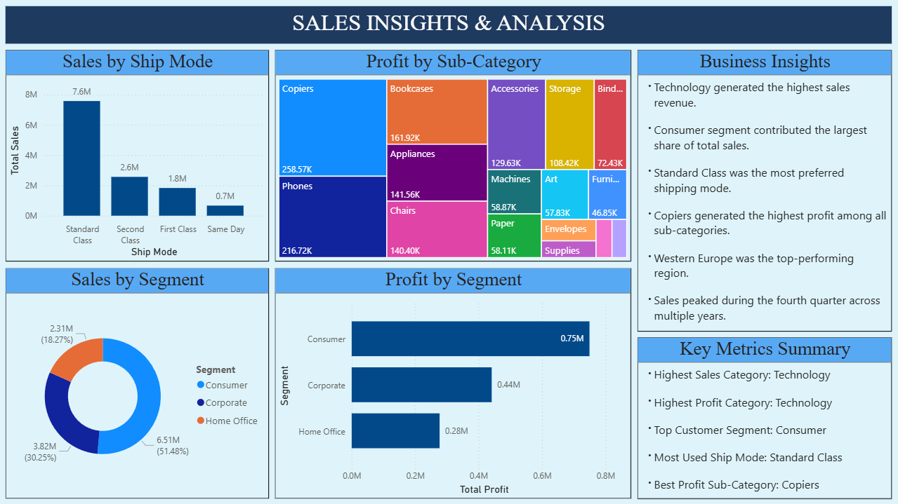

# Sales Performance Dashboard

## Dashboard Preview

### Sales Performance Dashboard

### Sales Insights & Analysis

## Project Overview

This project analyzes Global Superstore sales data to identify sales trends, evaluate profitability, and generate actionable business insights. The analysis was performed using Python, SQL, and Power BI.

The dashboard consists of two pages:

* Sales Performance Dashboard (Executive Overview)
* Sales Insights & Analysis (Detailed Business Insights)

## Dataset

The Global Superstore dataset contains sales transactions across multiple regions, categories, customer segments, and shipping modes. The dataset was used to analyze business performance, profitability, and sales trends.

## Tools & Technologies

* Python
* Pandas
* Matplotlib
* SQL (SQLite)
* Power BI
* Data Cleaning
* Exploratory Data Analysis (EDA)
* Data Visualization

## Project Objectives

* Analyze sales performance across regions and product categories
* Evaluate profitability and revenue trends
* Identify top-performing products and customer segments
* Generate business insights through interactive dashboards
* Support data-driven decision-making

## Key Metrics

* Total Sales: 12.64M
* Total Profit: 1.47M
* Total Quantity Sold: 178K+
* Profit Margin: 11.61%
* Total Customers: 1,590

## Key Insights

* Technology generated the highest sales revenue.
* Consumer segment contributed the largest share of total sales.
* Standard Class was the most preferred shipping mode.
* Copiers generated the highest profit among sub-categories.
* Western Europe was among the top-performing regions.
* Sales showed strong growth during peak seasonal periods.

## Dashboard Pages

### Sales Performance Dashboard

* KPI Cards
* Sales by Category
* Profit by Category
* Sales by Region
* Monthly Sales Trend
* Top Products Analysis

### Sales Insights & Analysis

* Sales by Segment
* Profit by Segment
* Sales by Ship Mode
* Profit by Sub-Category
* Business Insights
* Key Metrics Summary

## Project Structure

Sales-Performance-Dashboard/
│
├── Dashboard/
├── Data/
├── Images/
├── Notebooks/
├── SQL/
├── README.md

## Future Improvements

* Develop sales forecasting models using machine learning.
* Build automated reporting workflows.
* Integrate real-time business data sources.
* Perform advanced customer segmentation analysis.

## Author

Kunal Ubhare

Aspiring Data Analyst | Python | SQL | Power BI | Data Visualization
